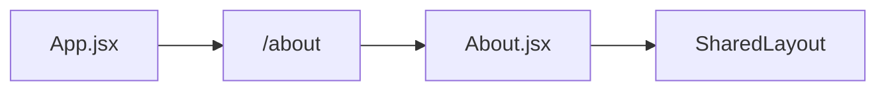
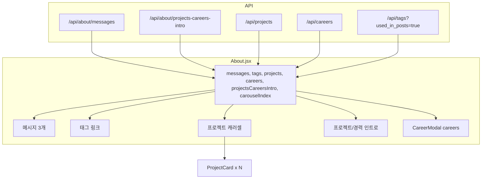
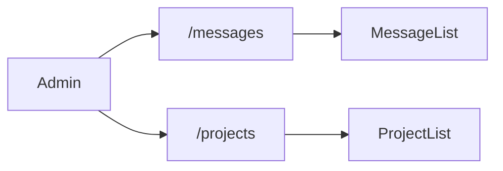

# 클라이언트 About 페이지 관련 로직 정리

클라이언트 앱에서 About 페이지와 연관된 라우팅, API, 데이터 흐름, UI 구성, 하위 컴포넌트를 정리한 문서입니다.

---

## 1. 라우팅·진입

- **App.jsx** (`apps/client/src/App.jsx`): `/about` 경로에 `About` 페이지 컴포넌트 연결.
- **SharedLayout.jsx** (`apps/client/src/components/SharedLayout.jsx`): 헤더·모바일 메뉴에 "About" 링크 (`/about`)로 네비게이션 제공.

---

## 2. API (About 전용·About에서 사용)

`apps/client/src/api.js`에 정의된 About 관련/사용 API:

| 함수 | 엔드포인트 | 용도 |
|------|------------|------|
| `fetchAboutMessages()` | `GET /api/about/messages` | 소개 메시지 목록 (sort_order 순) |
| `fetchProjectsCareersIntro()` | `GET /api/about/projects-careers-intro` | 프로젝트/경력 섹션 소개 문구 (최대 20자). 응답 `res.text` 사용 |
| `fetchProjects()` | `GET /api/projects` | 프로젝트 목록 (sort_order 순) |
| `fetchCareers()` | `GET /api/careers` | 경력 목록 (sort_order 순) |
| `fetchTags(opts)` | `GET /api/tags?used_in_posts=true` | 공개 포스트에 사용된 태그만 (post_count 포함) |

- `request()`: `config.js`의 `VITE_API_URL` 기준으로 프로덕션에서 절대 URL 사용, 개발 시에는 Vite proxy 상대 경로 사용.

---

## 3. About 페이지 데이터·UI 흐름

`apps/client/src/pages/About.jsx` 동작 요약:

### 초기 로드 (useEffect, 마운트 1회)

- `Promise.all`로 5개 API 동시 호출:
  - `fetchAboutMessages`, `fetchTags({ used_in_posts: true })`, `fetchProjects`, `fetchCareers`, `fetchProjectsCareersIntro`
- 취소 플래그(`cancelled`)로 언마운트 시 setState 방지.
- 반영 규칙:
  - `messages`: 배열이면 앞 3개만 (`slice(0, 3)`).
  - `tags`: 배열 그대로.
  - `projects`: 배열 그대로.
  - `careers`: `sortCareersByPeriodDesc`로 정렬 (end_date 내림, 동일하면 start_date 내림).
  - `projectsCareersIntro`: 문자열이면 그대로, 아니면 빈 문자열.

### 문서 타이틀

- 마운트 시 `document.title = 'About'`, 언마운트 시 `document.title = '정의랩'` 복원.

### 캐러셀(프로젝트 카드) 레이아웃

- `carouselRef`로 컨테이너 관찰 → `ResizeObserver`로 패딩 제거한 내부 너비 계산.
- 768px 미만: 1열, 이상: 3열. `CARD_WIDTH`·`CARD_GAP`(ProjectCard.jsx에서 export)로 카드 너비·간격 계산.
- `carouselIndex`로 `translate3d` 이동, 이전/다음 버튼·인디케이터로 인덱스 제어.

---

## 4. 화면 섹션 구성 (위에서 아래 순)

1. **헤더 문구**  
   "끝내는 기획자", "정의준입니다." 고정 문구.

2. **About 메시지 (messages)**  
   최대 3개. 그리드 1열(모바일) / 3열(데스크톱). 각 항목: 초록 점, `m.title`, `m.content`(줄바꿈 유지).

3. **연락처**  
   `mailto:ej@jungui.net` 링크 버튼 (고정).

4. **태그**  
   `tags` 배열을 링크로 표시. `to={/?tag=${t.id}}`로 이동, 라벨은 `t.name` 또는 `t.name (t.post_count)`.

5. **프로젝트·경력**  
   제목 "프로젝트" + "경력" 버튼(클릭 시 경력 모달 오픈).  
   `projectsCareersIntro`가 있으면 그대로 문단으로 표시.  
   프로젝트: `projects.length > 0`이면 캐러셀(ProjectCard 나열), 좌우 블러·이전/다음·인디케이터; 없으면 "등록된 프로젝트가 없습니다." 문구.

6. **경력 모달**  
   `CareerModal`: `open={careerModalOpen}`, `onClose`, `careers` 전달. 모달 안에서 경력 목록 타임라인 형태로 표시.

---

## 5. 하위 컴포넌트 역할

- **SharedLayout**: 공통 헤더/푸터/네비. About에서는 `categories={[]}`로 전달(카테고리 메뉴 없음).
- **ProjectCard**: `project` 1건 표시. 썸네일(`getStaticUrl`), 제목, 기간, 링크 아이콘(`getLinkIcon`), 설명, 태그. `CARD_WIDTH`(320), `CARD_GAP`(24) export.
- **CareerModal**: `careers` 배열을 타임라인으로 표시. 기간 포맷, 로고(`getStaticUrl`), 링크·하이라이트·태그 제한 표시. createPortal로 body 스크롤 잠금.

---

## 6. 데이터 흐름 요약

---

## 7. 백엔드 연동 요약

- About 전용 백엔드: `/api/about/messages`, `/api/about/projects-careers-intro`.
- 그 외 About 페이지에서 사용: `/api/projects`, `/api/careers`, `/api/tags` (공개 데이터만 사용).

---

# 백오피스 (About 관련 로직)

백오피스에서 클라이언트 About 페이지에 노출되는 데이터를 관리하는 부분만 정리합니다. (프로젝트·경력 CRUD는 프로젝트/경력 관리 문서로 두고, 여기서는 **About 메시지**와 **프로젝트/경력 소개 문구**만 다룹니다.)

---

## 1. 라우팅·메뉴

- **App.jsx** (`apps/backoffice/src/App.jsx`): `CustomRoutes`에 `/messages` → `MessageList` 연결.
- **AdminLayout.jsx**: 사이드바에 "소개 관리" 섹션. 하위 메뉴: "메시지"(`/messages`), "프로젝트"(`/projects`), "경력"(`/careers`). 현재 경로가 이 중 하나이면 아코디언 자동 오픈.

---

## 2. About 메시지 관리 (MessageList)

**파일:** `apps/backoffice/src/pages/messages/MessageList.jsx`

- **역할:** 클라이언트 About 페이지 상단에 나오는 인사말 메시지(과거/현재/미래 등) 최대 3개를 CRUD.
- **제약:** 제목 최대 20자(`TITLE_MAX`), 내용 최대 120자(`CONTENT_MAX`). 최대 3개만 추가 가능.

### API 호출

| 동작 | 메서드 | 엔드포인트 |
|------|--------|------------|
| 목록 조회 | GET | `/api/about_messages` |
| 추가 | POST | `/api/about_messages` (body: `title`, `content`, `sort_order`) |
| 수정 | PUT | `/api/about_messages/:id` (body: `title`, `content`, `sort_order`) |
| 삭제 | DELETE | `/api/about_messages/:id` |

- 수정 시 "노출 순서"(1~3) 변경 가능. 순서가 바뀐 항목만 PUT으로 `sort_order` 갱신.

### UI

- 목록: 순번, 제목, 내용(잘림), 수정/삭제 버튼.
- 추가: "메시지 추가" 버튼 → 다이얼로그(제목, 내용, 노출 순서). 추가 시 순서는 `items.length + 1`로만 표시, 저장 시에는 기존 최대 `sort_order + 1`로 전송.
- 수정: 다이얼로그에서 제목·내용·노출 순서(1~3) 변경 후 저장 시, 전체 순서 재계산 후 변경된 항목만 PUT.

---

## 3. 프로젝트/경력 소개 문구 (ProjectList 내)

**파일:** `apps/backoffice/src/pages/projects/ProjectList.jsx`

- **역할:** 클라이언트 About 페이지의 "프로젝트·경력" 섹션 제목 아래 한 줄 소개 문구(최대 20자) 편집.
- **진입:** 프로젝트 목록 상단 "소개 문구" 버튼 클릭 → 다이얼로그 오픈.

### API 호출

| 동작 | 메서드 | 엔드포인트 |
|------|--------|------------|
| 조회 | GET | `/api/about/projects-careers-intro` (응답 `data.text`) |
| 저장 | PUT | `/api/about_messages/projects-careers-intro` (body: `{ text }`, 최대 20자로 slice 후 전송) |

### UI

- 다이얼로그: "프로젝트/경력 소개 문구" 제목, 설명(클라이언트 소개 페이지 해당 섹션에 표시됨, 최대 20자), 텍스트 필드, `현재길이/20자` 표시. 20자 초과 시 저장 비활성화.

---

## 4. 백오피스 API 요약 (About 관련)

- **About 메시지(인사말):** `/api/about_messages` (목록/추가), `/api/about_messages/:id` (수정/삭제). 백오피스는 `about_messages`(언더스코어) 사용.
- **프로젝트/경력 소개 문구:** 조회 `GET /api/about/projects-careers-intro`, 저장 `PUT /api/about_messages/projects-careers-intro`.

클라이언트가 읽을 때는 `GET /api/about/messages`, `GET /api/about/projects-careers-intro`를 사용하므로, 백엔드가 두 경로를 어떻게 매핑하는지에 따라 동일 리소스일 수 있음.
